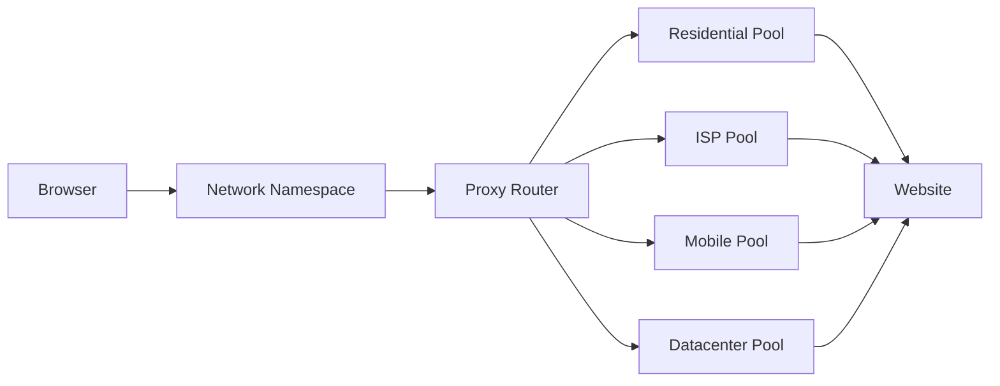

# Proxies

Meshbrow routes each browser session through a proxy so your agents browse from realistic locations worldwide. The proxy system features automatic failover, quality scoring, and multi-provider aggregation.

## Architecture



## Quality Scoring

Every proxy is continuously scored on:

- **Success rate** — Percentage of requests that succeed
- **Speed** — Latency percentiles (p50, p95)
- **Detection rate** — How often the proxy triggers anti-bot
- **Ban rate** — How often the IP gets blocked
- **Uptime** — Availability over time

Low-scoring proxies are automatically deprioritized. Providers that fall below threshold are disabled with automatic recovery checks.

## Geo-Verification

Meshbrow verifies that proxies actually resolve to the requested geography:

```typescript
// Request US proxy
const session = await client.sessions.create({
  proxy: { type: 'residential', country: 'US', city: 'New York' },
});

// Meshbrow verifies the assigned IP resolves to US before accepting
```

If geo-verification fails, the proxy is rejected and another is selected.

## Provider Failover

If a provider experiences degraded quality:

1. Quality score drops below threshold
2. Provider is disabled for new sessions
3. Recovery checks run periodically
4. Provider re-enabled when health recovers

This happens transparently — your sessions always get a working proxy.

## Cost Tracking

Proxy costs are tracked per-session:

- Bandwidth-based billing (residential, mobile)
- Per-IP billing (ISP, dedicated)
- Session-level cost attribution
- Provider-level spend analytics
