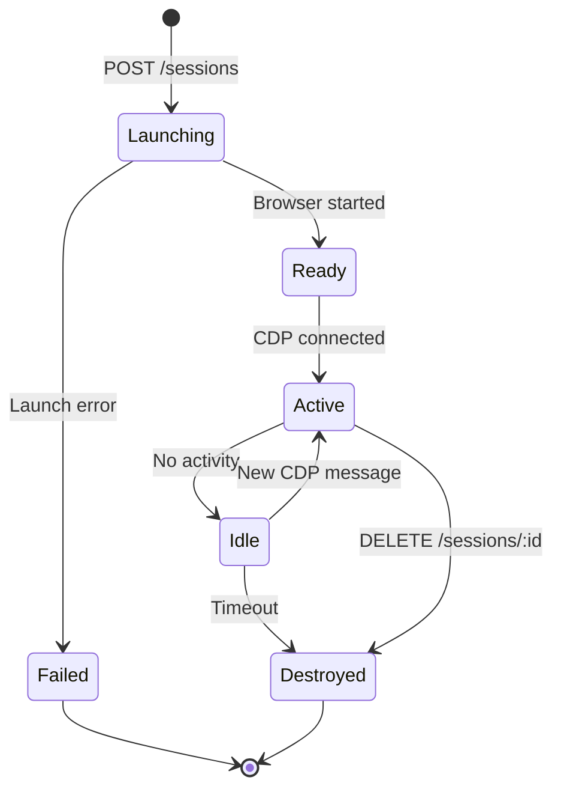

# Sessions

A **session** is a running browser instance managed by Meshbrow. Each session is an isolated Chromium process with its own network namespace, fingerprint, and proxy.

## Lifecycle

## Session Properties

| Property | Description |
|----------|-------------|
| `id` | Unique identifier (e.g., `ses_k8m2n4p6`) |
| `cdpUrl` | WebSocket URL for Playwright/Puppeteer |
| `status` | Current lifecycle state |
| `proxy` | Assigned proxy (type, IP, country) |
| `fingerprint` | Generated browser fingerprint |
| `expiresAt` | Auto-destroy timestamp |

## Isolation

Each session runs in complete isolation:

- **Network**: Own network namespace with dedicated IP
- **Process**: Separate Chromium process with PID isolation
- **Filesystem**: Dedicated user data directory (cookies, cache)
- **Memory**: cgroup memory limits (max 512MB default)

No data leaks between sessions. Cross-session traffic is architecturally impossible.

## Timeouts

| Type | Default | Max |
|------|---------|-----|
| Session duration | 30 min | 60 min |
| Idle timeout | 5 min | 30 min |
| Launch timeout | 10 sec | 30 sec |

## Limits

| Plan | Concurrent Sessions |
|------|-------------------|
| Free | 5 |
| Pro | 50 |
| Enterprise | 500 |
