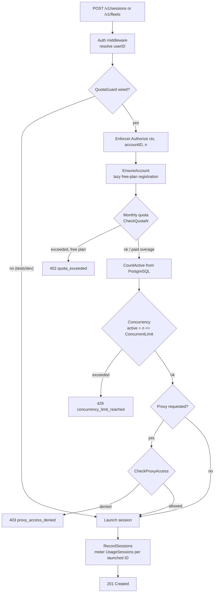

# Billing Guardrails — Plan Limit Enforcement

Every session launch (single or fleet) is gated against the account's plan limits before any browser is started.

## Limits per plan

| Plan | Sessions/month | Concurrent | Over-quota behavior |
|------|:---:|:---:|---|
| Free | 100 | 2 | Hard block (`402 quota_exceeded`) |
| Pro | 5,000 | 10 | Overage billed ($0.02/session) |
| Scale | 50,000 | 50 | Overage billed ($0.01/session) |

Concurrency is always a hard limit (`429 concurrency_limit_reached`). Proxy types not included in the plan are rejected (`403 proxy_access_denied`).

## Enforcement flow

## Components

- `billing.Enforcer` ([internal/billing/enforcer.go]) — combines the meter service with an active-session counter (`database.SessionStore.CountActive`).
- `billing.MeterService.CheckQuotaN` — monthly quota; free tier blocks at the limit, paid tiers allow metered overage.
- `billing.MeterService.CheckConcurrency` — `active + requested > plan.ConcurrentLimit` → rejection.
- `api.SessionHandler` / `fleet.Handler` — consume the `QuotaGuard` interface; limit errors carry their own HTTP status and structured code via `HTTPStatus()` / `ErrorCode()`.
- Fleet creation authorizes the **entire count up front** — a fleet of 10 on a free plan (concurrent limit 2) is rejected before any session launches.

## Usage metering

Each successfully launched session is recorded as a `UsageSessions` record against the account, advancing the monthly quota counter used by `CheckQuotaN`, `/v1/status`, and `/v1/billing/usage`.
