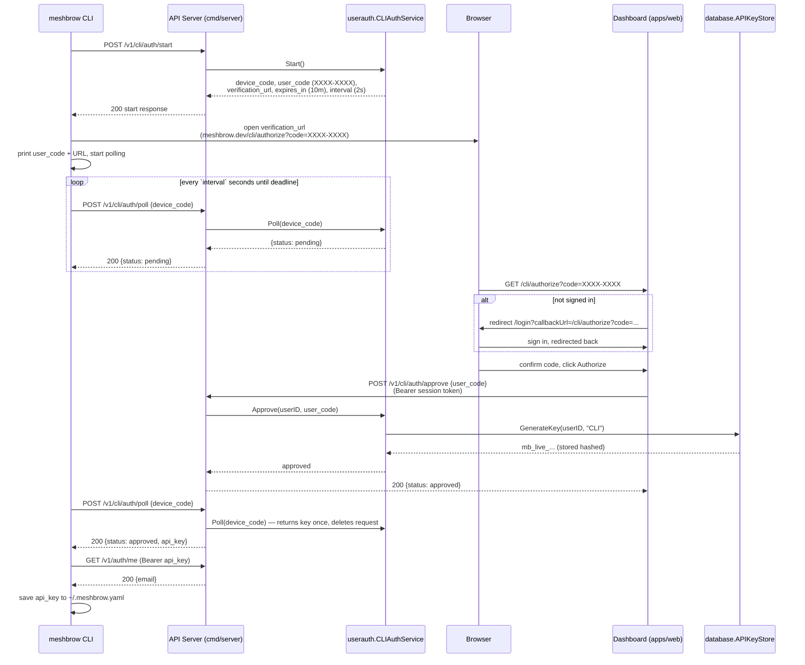
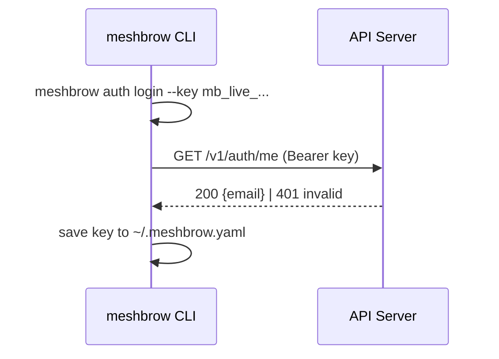

# CLI Browser Login Flow

How `meshbrow auth login` authenticates via the browser (device authorization flow), with `--key` as the manual fallback.

## Browser Flow (default)

## Manual Flow

## Security Properties

- **Device code** (64 hex chars) is the polling secret — only ever held by the CLI; never shown in the browser or URL.
- **User code** (`XXXX-XXXX`, unambiguous alphabet) is what travels through the browser; it cannot be used to retrieve the key, only to approve.
- Requests expire after **10 minutes** and approval is **single-use**; the API key is returned to the poller **exactly once**, then the request is deleted.
- Approval requires an authenticated dashboard session (`userauth.AuthMiddleware`).
- Pending requests are capped (1000) to bound memory; expired entries are swept on each start.
- The web login redirect only honors same-origin relative `callbackUrl` values (no open redirect).

## Error Scenarios

| Scenario | Behavior |
|----------|----------|
| User never approves | Poll returns `expired` after TTL; CLI exits with retry hint |
| Wrong code entered on web | `400 invalid or expired code` |
| Code approved twice | Second approve fails (single-use) |
| Key generation fails (DB down) | Request stays `pending`, user can retry approval |
| Server restart mid-flow | In-memory request lost; poll returns `expired`, CLI prompts re-run |
| Browser cannot be opened | CLI prints the URL for manual opening and keeps polling |
