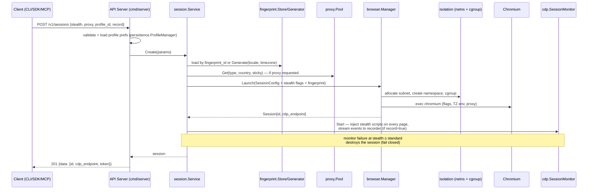
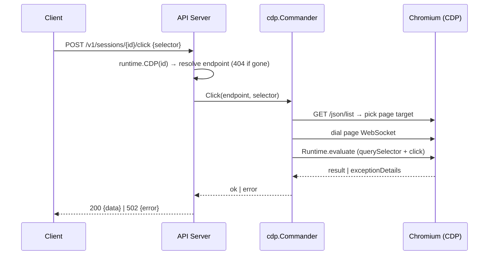
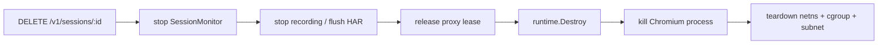

# Session Lifecycle & Action Flow

How a session request travels through the wired-together stack: fingerprint generation, stealth injection, proxy acquisition, isolation, and live CDP actions.

## Session Creation

## Page Actions

Same pipeline serves `/navigate` (Page.navigate + lifecycle event wait), `/execute`, `/type`, `/extract`, `/wait`, `/scroll`, `/screenshot` (Page.captureScreenshot), and `/cookies` (Network.getAllCookies / setCookies).

## Session Destroy

