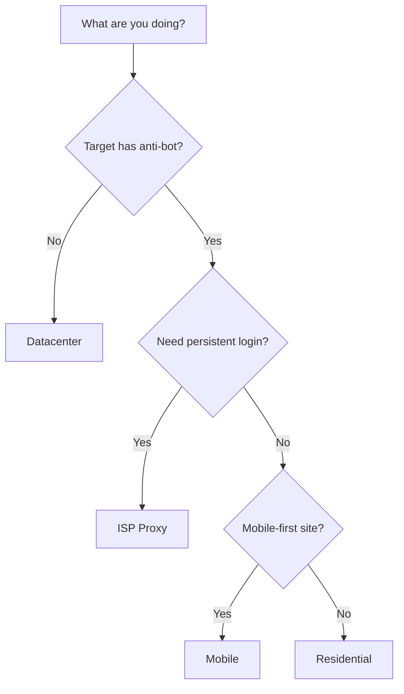

# Proxy Selection Guide

Meshbrow supports multiple proxy types. Choosing the right one impacts detection rates, speed, and cost.

## Proxy Types at a Glance

| Type | Speed | Detection Risk | Cost | Best For |
|------|-------|---------------|------|----------|
| **Residential** | Medium | Very Low | $$$ | E-commerce, social media, general scraping |
| **ISP** | Fast | Low | $$$$ | Long sessions, account management |
| **Mobile** | Slow | Very Low | $$$$$ | Mobile-only sites, highest trust score |
| **Datacenter** | Very Fast | Medium | $ | High-volume, low-detection targets |

## Residential Proxies

Real IPs assigned by ISPs to homeowners. Rotated from a pool of millions.

```typescript
const session = await client.sessions.create({
  proxy: {
    type: 'residential',
    country: 'US',
    city: 'New York',
  },
});
```

**Pros:**
- Appear as real users
- Large IP pools (low ban risk)
- Good geo-targeting

**Cons:**
- Slower than datacenter
- More expensive
- IPs rotate (not sticky by default)

**Best for:** General web scraping, e-commerce monitoring, ad verification, SEO tools.

## ISP Proxies (Static Residential)

Datacenter-hosted IPs registered under real ISPs. Combines speed with residential trust.

```typescript
const session = await client.sessions.create({
  proxy: {
    type: 'isp',
    country: 'US',
    sticky: true, // Same IP for session duration
  },
});
```

**Pros:**
- Fast (datacenter speed)
- High trust (residential ISP)
- Static IPs (same IP every time)

**Cons:**
- Smaller IP pools
- Most expensive residential option
- Limited geo coverage

**Best for:** Account management, long-running sessions, login-dependent workflows, social media automation.

## Mobile Proxies

IPs from real mobile carriers (4G/5G). Shared among thousands of users naturally.

```typescript
const session = await client.sessions.create({
  proxy: {
    type: 'mobile',
    country: 'US',
  },
});
```

**Pros:**
- Highest trust score
- Nearly impossible to ban (shared IPs)
- Perfect for mobile-first sites

**Cons:**
- Slowest option
- Most expensive
- Very limited geo options

**Best for:** Social media (Instagram, TikTok), mobile-only APIs, sites with aggressive anti-bot.

## Datacenter Proxies

IPs from cloud providers. Fast and cheap but easier to detect.

```typescript
const session = await client.sessions.create({
  proxy: {
    type: 'datacenter',
    country: 'US',
  },
});
```

**Pros:**
- Fastest option
- Cheapest
- Unlimited bandwidth

**Cons:**
- Higher detection risk
- Often pre-blocked by sites
- IPs in known datacenter ranges

**Best for:** Low-security targets, internal tools, high-volume non-sensitive scraping, development/testing.

## Decision Flowchart



## Geo-Targeting

All proxy types support geographic targeting:

```typescript
// Region-level (cheapest, most available)
{ type: 'residential', region: 'us' }

// Country-level
{ type: 'residential', country: 'US' }

// City-level (most expensive, limited availability)
{ type: 'residential', country: 'US', city: 'New York' }
```

<Note>
  More specific targeting = smaller IP pool = higher cost. Use the broadest targeting that meets your requirements.
</Note>

## Sticky vs Rotating

| Mode | Behavior | Use Case |
|------|----------|----------|
| **Rotating** (default) | New IP on each session | High-volume scraping |
| **Sticky** | Same IP persists | Account management, multi-page workflows |

```typescript
// Sticky session - same IP throughout
const session = await client.sessions.create({
  proxy: { type: 'isp', country: 'US', sticky: true },
});
```

## Cost Optimization Tips

<AccordionGroup>
  <Accordion title="Start with datacenter, escalate as needed">
    Many sites don't have anti-bot. Test with datacenter first — only upgrade to residential if you get blocked.
  </Accordion>
  <Accordion title="Use region targeting over city targeting">
    City-level targeting costs 2-3x more. Most use cases only need country-level.
  </Accordion>
  <Accordion title="Use ISP for long sessions instead of residential">
    Residential proxies charge per GB. ISP proxies are often flat-rate for the session.
  </Accordion>
  <Accordion title="Batch requests in fewer sessions">
    Launch fewer, longer sessions rather than many short ones. Session setup has overhead.
  </Accordion>
</AccordionGroup>

## BYOP (Bring Your Own Proxy)

Already have proxy subscriptions? Use them with Meshbrow:

```typescript
const session = await client.sessions.create({
  proxy: {
    type: 'custom',
    host: 'proxy.yourprovider.com',
    port: 8080,
    username: 'user',
    password: 'pass',
  },
  stealth: 'max', // Still get full anti-detection
});
```

This lets you use Meshbrow's stealth features with your existing proxy infrastructure.
