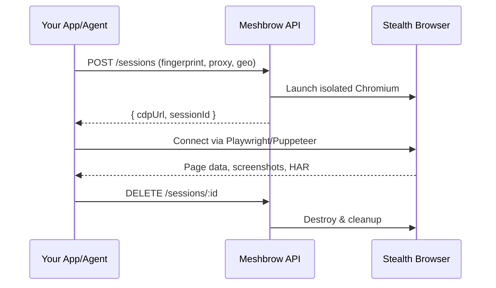

# Welcome to Meshbrow

Meshbrow is a **managed browser fleet** that lets developers and AI agents launch cloud-hosted stealth Chromium browsers with anti-detection, unique fingerprints, proxy rotation, and built-in plan guardrails.

## Why Meshbrow?

Modern websites deploy increasingly sophisticated bot detection. Browser fingerprinting, TLS analysis, and behavioral heuristics make traditional scraping unreliable. Meshbrow solves this by providing:

<CardGroup cols={2}>
  <Card title="Stealth Browsers" icon="user-secret">
    Every session gets a unique, consistent fingerprint that passes CreepJS, FingerprintJS, and BotD checks.
  </Card>
  <Card title="Proxy Rotation" icon="rotate">
    Multi-provider pool with residential, ISP, mobile, and datacenter proxies. Automatic failover and quality scoring.
  </Card>
  <Card title="Full Isolation" icon="shield-halved">
    Each browser runs in its own network namespace with dedicated IP, preventing cross-session fingerprint leakage.
  </Card>
  <Card title="Session Persistence" icon="cookie">
    Save and restore cookies, localStorage, and login states across sessions. Named profiles for reusable identities.
  </Card>
</CardGroup>

## How It Works



## Connect with Any Tool

Meshbrow exposes standard **Chrome DevTools Protocol (CDP)** — connect with any tool that speaks CDP:

- **Playwright** (Node.js, Python, .NET, Java)
- **Puppeteer** (Node.js)
- **Selenium** (any language)
- **CDP direct** (raw WebSocket)
- **MCP Tools** (for AI agents like Claude, GPT, etc.)

## Quick Example

```typescript
import { chromium } from 'playwright';

const browser = await chromium.connectOverCDP(
  'wss://api.meshbrow.dev/cdp/session_abc?token=mb_live_...'
);

const page = browser.contexts()[0].pages()[0];
await page.goto('https://example.com');
console.log(await page.title());
```

## Next Steps

<CardGroup cols={2}>
  <Card title="Quickstart" icon="rocket" href="/quickstart">
    Get your first session running in 2 minutes.
  </Card>
  <Card title="API Reference" icon="code" href="/api-reference/overview">
    Full REST API documentation.
  </Card>
  <Card title="Playwright Guide" icon="masks-theater" href="/guides/playwright">
    Connect Playwright to Meshbrow browsers.
  </Card>
  <Card title="Anti-Detection" icon="shield" href="/guides/anti-detection">
    Best practices for staying undetected.
  </Card>
</CardGroup>
