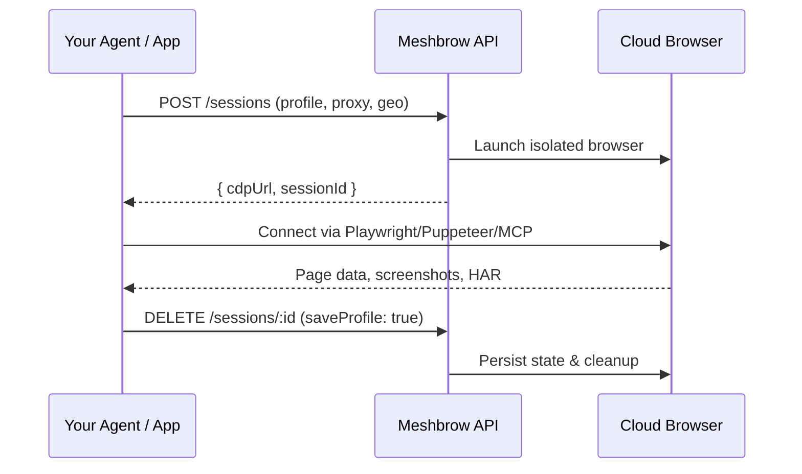

# Welcome to Meshbrow

Meshbrow gives every AI agent **its own persistent cloud browser** — with saved login sessions, isolated identities, and the ability to navigate the real web without getting blocked.

## Why Meshbrow?

AI agents need to interact with the web the same way humans do: logging into SaaS tools, navigating dashboards, filling forms, and extracting data. But cloud-hosted browsers face two problems — they lose state between runs, and they get detected as bots.

Meshbrow solves both:

<CardGroup cols={2}>
  <Card title="Session Persistence" icon="cookie">
    Save and restore cookies, localStorage, and login states across sessions. Your agent logs into Stripe once — and remembers it tomorrow.
  </Card>
  <Card title="Undetectable Browsing" icon="shield-halved">
    Every session gets a unique, consistent fingerprint. Canvas noise, WebGL spoofing, TLS matching — passes CreepJS, FingerprintJS, and BotD.
  </Card>
  <Card title="Full Isolation" icon="lock">
    Each browser runs in its own network namespace with a dedicated IP. No cross-session leakage, no shared state.
  </Card>
  <Card title="Observable & Debuggable" icon="eye">
    HAR capture, screenshots, DOM snapshots, and session recording. See exactly what your agent sees.
  </Card>
</CardGroup>

## How It Works



## Connect with Any Tool

Meshbrow exposes standard **Chrome DevTools Protocol (CDP)** — connect with any tool that speaks CDP:

- **Playwright** (Node.js, Python, .NET, Java)
- **Puppeteer** (Node.js)
- **Selenium** (any language)
- **MCP Tools** (Claude, GPT, custom agents)
- **CDP direct** (raw WebSocket)

## Quick Example

```typescript
import { chromium } from 'playwright';

const browser = await chromium.connectOverCDP(
  'wss://api.meshbrow.dev/cdp/session_abc?token=mb_live_...'
);

const page = browser.contexts()[0].pages()[0];
await page.goto('https://app.hubspot.com');
// Agent is already logged in — session was persisted from last run
console.log(await page.title());
```

## Next Steps

<CardGroup cols={2}>
  <Card title="Quickstart" icon="rocket" href="/quickstart">
    Get your first session running in 2 minutes.
  </Card>
  <Card title="API Reference" icon="code" href="/api-reference/overview">
    Full REST API documentation.
  </Card>
  <Card title="Playwright Guide" icon="masks-theater" href="/guides/playwright">
    Connect Playwright to Meshbrow browsers.
  </Card>
  <Card title="MCP / AI Agents" icon="robot" href="/guides/mcp-agents">
    Give your AI agents persistent browser access.
  </Card>
</CardGroup>
